<p align="center">
  
</p>

<h2 align="center">Ramon Vallés Puig</h2>
<p align="center">
  <code>Software Engineer</code> · <code>Researcher</code>
</p>
<p align="center">
  <a href="https://vpramon.github.io/">portfolio</a> ·
  <a href="https://orcid.org/0000-0001-7701-2163">ORCID</a> ·
  <a href="https://siderust.org/">Siderust</a>
</p>

## `$ whoami`

I'm a software engineer and researcher interested in the intersection of **scientific computing, systems programming, cybersecurity, and optimization**.

I currently work at **ICE-CSIC** on software for the **Cherenkov Telescope Array Observatory (CTAO)** and pursue a PhD in Computer Science at **UAB**, researching multi-objective scheduling and optimization for astronomical observatories.

I like understanding how complex systems work, how they fail, and how to make them easier to trust. I also have a habit of following technical rabbit holes further than strictly necessary.

## `$ currently`

```text
research       multi-objective scheduling & optimization
engineering    scientific / astronomical software
thinking       correctness · performance · secure systems
using          Rust · C++ · Python · TypeScript · PostgreSQL
learning       whatever rabbit hole looked interesting this week
breaking       assumptions (preferably only my own)
```

## `$ interests --recursive`

```text
science/
├── astronomy
├── astrodynamics
├── scientific computing
└── observation scheduling

systems/
├── Rust / C++
├── software architecture
├── cybersecurity
└── reliable software

intelligence/
├── optimization
├── machine learning
└── decision systems
```

## `$ side_quests`

A few things I build when one problem is not enough:

| project | what it is |
| --- | --- |
| [`Siderust`](https://github.com/Siderust/siderust) | Scientific Rust ecosystem for astronomy and astrodynamics. |
| [`Marreq`](https://github.com/MarreqSW/Marreq) | Requirements, verification, baselines and traceability. |
| [`TSI`](https://github.com/VPRamon/TSI) | Telescope scheduling analysis and visualization. |

## `$ activity --live`

<p align="center">
  <a href="https://github.com/Ashutosh00710/github-readme-activity-graph">
    
  </a>
</p>

## `$ connections --established`

<p align="center">
  <sub>incoming connections accepted</sub><br/><br/>
  
</p>

---

<p align="center">
  <code>build things · question assumptions · keep learning</code>
</p>

<!--
  source inspection detected.

  access granted.

  flag{curiosity_is_a_feature}
-->
